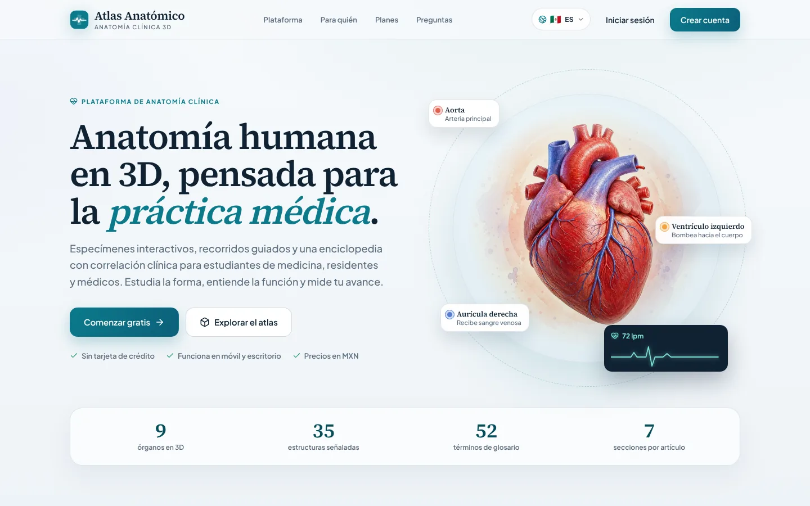
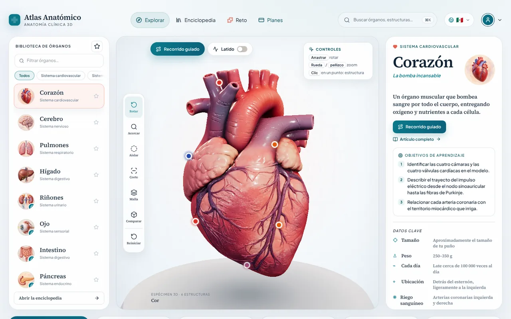
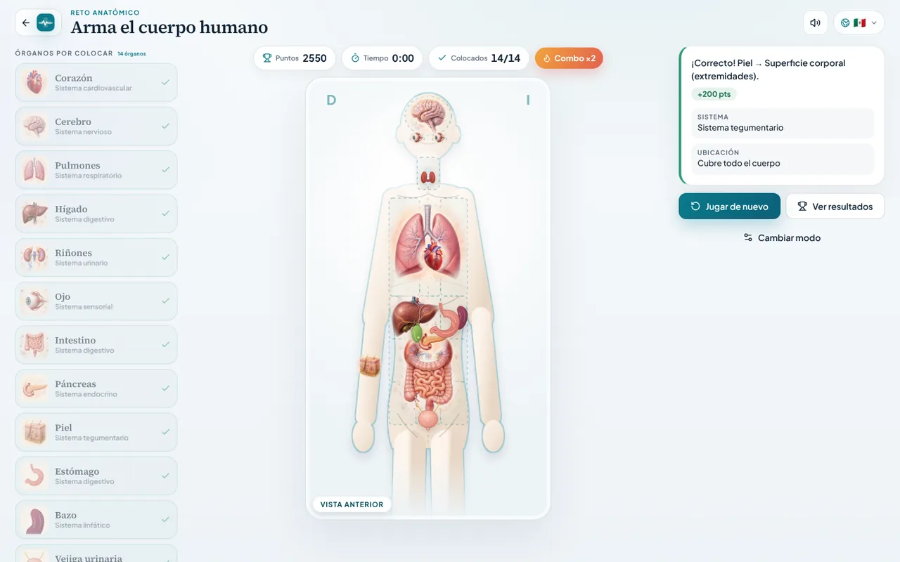
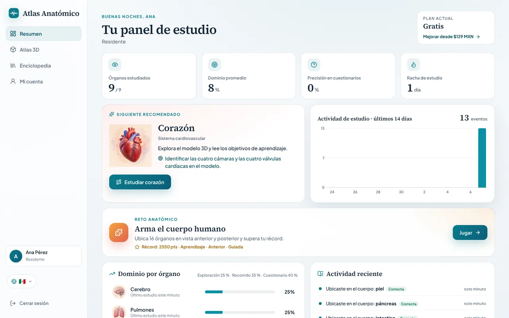
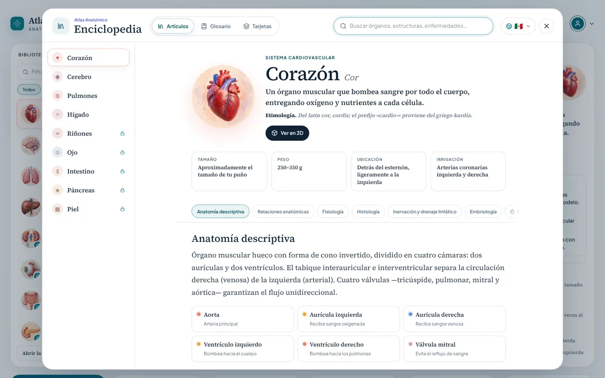
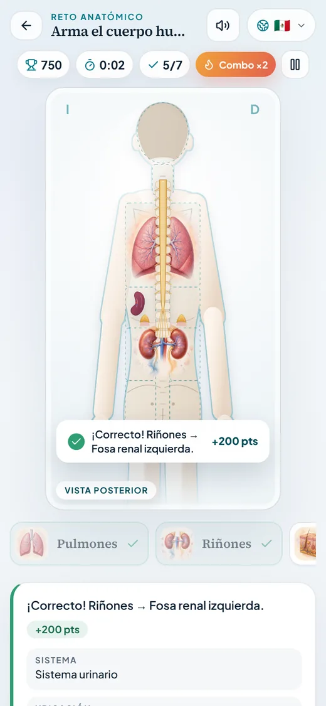
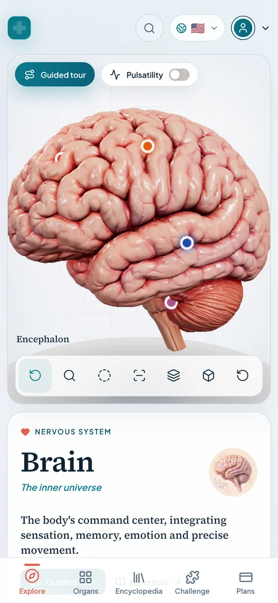
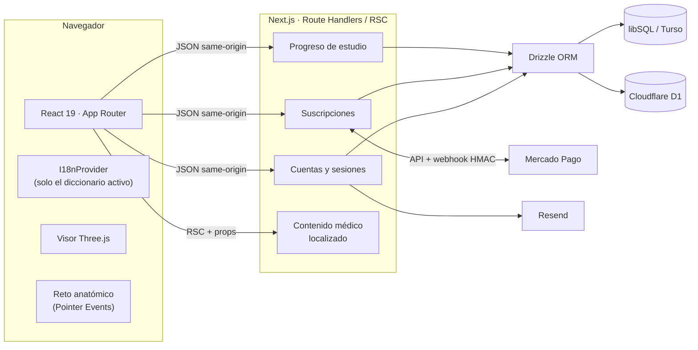

<div align="center">


# Atlas Anatómico

**Anatomía clínica en 3D para la formación médica.**

Especímenes interactivos, enciclopedia con correlación clínica, un reto de ubicación anatómica<br />
y suscripciones en pesos mexicanos para estudiantes de medicina, residentes, médicos y docentes.

[](https://nextjs.org)
[](https://react.dev)
[](https://www.typescriptlang.org)
[](https://threejs.org)
[](https://orm.drizzle.team)
[](https://playwright.dev)
[](#internacionalización)
[](#licencia)

[Características](#características) ·
[Capturas](#capturas) ·
[Inicio rápido](#inicio-rápido) ·
[Arquitectura](#arquitectura) ·
[Pruebas](#pruebas) ·
[Despliegue](#despliegue) ·
[Contribuir](#contribuir)

<br />



</div>

---

## Contenido

- [Visión general](#visión-general)
- [Características](#características)
- [Capturas](#capturas)
- [Stack tecnológico](#stack-tecnológico)
- [Inicio rápido](#inicio-rápido)
- [Variables de entorno](#variables-de-entorno)
- [Scripts](#scripts)
- [Arquitectura](#arquitectura)
- [Pruebas](#pruebas)
- [Despliegue](#despliegue)
- [Seguridad](#seguridad)
- [Internacionalización](#internacionalización)
- [Accesibilidad y rendimiento](#accesibilidad-y-rendimiento)
- [Hoja de ruta](#hoja-de-ruta)
- [Contribuir](#contribuir)
- [Licencia](#licencia)

## Visión general

Atlas Anatómico convierte el estudio de la anatomía en una experiencia **visual, guiada y medible**. Cada órgano es un
espécimen 3D con estructuras señaladas, recorridos guiados y fisiología animada. Además, tiene una ficha clínica y
un artículo en la enciclopedia. El progreso se registra en un panel de estudio, y el **Reto anatómico** pone a prueba
la orientación espacial con nomenclatura clínica real.

La plataforma está pensada para México y Latinoamérica: precios en **MXN con IVA incluido**, cobros con
**Mercado Pago** y una interfaz **bilingüe** (español de México e inglés de EUA) que cambia de idioma en tiempo real.

## Características

| | Funcionalidad | Detalle |
|:-:|---|---|
| 🫀 | **Atlas 3D** | 9 especímenes interactivos con estructuras señaladas, corte, aislamiento, malla y comparación. Recorrido guiado estructura por estructura y fisiología animada (latido a 72 lpm, respiración, peristalsis…). |
| 📚 | **Enciclopedia** | Artículos de 7 secciones con correlación clínica, búsqueda sin acentos (`⌘K`), glosario A–Z y tarjetas de estudio con repaso de pendientes. |
| 🧩 | **Reto anatómico** | Arrastra 16 órganos a su región clínica en **vista anterior y posterior**, con giro 3D del cuerpo. Modos Aprendizaje, Examen y Contrarreloj; dificultad Guiada o Experto, combos, pistas y récords. |
| 📈 | **Panel de estudio** | Dominio por órgano, precisión, racha, actividad de 14 días, recomendación del siguiente tema y récord del reto. |
| 💳 | **Suscripciones** | Planes en MXN, 7 días de prueba gratis, checkout alojado por Mercado Pago, cambio de plan sin cobros duplicados y cancelación con acceso hasta el fin del periodo. |
| 🔐 | **Cuentas** | Registro, inicio de sesión, verificación de correo y recuperación de contraseña con correos transaccionales. |
| 🌐 | **Bilingüe en vivo** | es-MX / en-US con fundido de salida y entrada, sin recargar ni perder el estado. Traduce también los errores de la API, los correos y los metadatos. |
| ✨ | **Micro-interacciones** | Transiciones de página, barra de progreso, toasts, modales de confirmación, esqueletos de carga, confeti y Animate.css. Todo respeta `prefers-reduced-motion`. |

### El reto anatómico

La evaluación usa la **convención clínica**. En vista anterior, la derecha del paciente queda a la izquierda del
observador; en la posterior, a la derecha. El reto responde con tres niveles: **correcto** (región principal),
**aceptable** (región a la que el órgano se extiende, por ejemplo el hígado en el epigastrio) e **incorrecto**,
siempre nombrando la región donde se soltó.

| Vista | Regiones evaluadas | Órganos |
|---|---|---|
| Anterior | Cavidad craneal, órbitas, cuello, hemitórax, mediastino y las 9 regiones abdominales | 14 |
| Posterior | Región occipital, nucal y vertebral, hemitórax posteriores, regiones toracolumbares, fosas renales y regiones glúteas | 7 |

## Capturas

<table>
  <tr>
    <td width="50%"><br /><sub><b>Atlas 3D</b> · espécimen interactivo con ficha clínica</sub></td>
    <td width="50%"><br /><sub><b>Reto anatómico</b> · 14 órganos en vista anterior</sub></td>
  </tr>
  <tr>
    <td width="50%"><br /><sub><b>Panel de estudio</b> · progreso, actividad y récord</sub></td>
    <td width="50%"><br /><sub><b>Enciclopedia</b> · artículos, glosario y tarjetas</sub></td>
  </tr>
  <tr>
    <td width="50%" align="center"><br /><sub><b>Móvil</b> · reto en vista posterior</sub></td>
    <td width="50%" align="center"><br /><sub><b>Móvil</b> · atlas en inglés (en-US)</sub></td>
  </tr>
</table>

## Stack tecnológico

| Capa | Tecnología |
|---|---|
| Framework | [Next.js 16](https://nextjs.org) (App Router, React Server Components) · [vinext](https://www.npmjs.com/package/vinext) para Cloudflare Workers |
| UI | React 19, TypeScript estricto, Tailwind CSS 4 + CSS propio con tokens de diseño, [lucide-react](https://lucide.dev) |
| 3D y animación | [Three.js](https://threejs.org) (glTF + Draco/Basis), [GSAP](https://gsap.com), [Animate.css](https://animate.style) (subconjunto generado) |
| Datos | [Drizzle ORM](https://orm.drizzle.team) sobre libSQL / [Turso](https://turso.tech) (Node, Vercel) o Cloudflare D1 (Workers), con migraciones versionadas en tiempo de ejecución |
| Pagos y correo | [Mercado Pago Suscripciones](https://www.mercadopago.com.mx/developers) · [Resend](https://resend.com) |
| Calidad | ESLint, `node:test` para pruebas unitarias y SSR, [Playwright](https://playwright.dev) para E2E |

## Inicio rápido

**Requisitos:** Node.js `>= 22.13` y npm.

```bash
git clone https://github.com/carlosjaime/anatomy-saas.git
cd anatomy-saas
npm install
npm run dev:next
```

Abre <http://localhost:3000>. En desarrollo no hace falta configurar nada:

- La base de datos es un archivo SQLite local (`.data/atlas.db`) y el esquema se crea solo.
- Los pagos usan un **proveedor de demostración** que autoriza al instante.
- Los correos (verificación y recuperación) se **imprimen en la consola** del servidor.

Para trabajar con el runtime de Cloudflare Workers usa `npm run dev`, que levanta vinext con el binding D1 local `DB`.

## Variables de entorno

Copia `.env.example` a `.env.local` y completa lo que necesites. En producción, la app desactiva de forma segura
cualquier integración que no esté configurada.

| Variable | Requerida en producción | Descripción |
|---|:-:|---|
| `DATABASE_URL` | ✅ (Vercel/Node) | URL de libSQL, por ejemplo Turso. En Cloudflare se usa el binding D1 `DB`. |
| `DATABASE_AUTH_TOKEN` | Según el proveedor | Token de acceso de la base libSQL. |
| `APP_URL` | ✅ | URL pública para los enlaces de correo y el regreso desde Mercado Pago. |
| `MERCADOPAGO_ACCESS_TOKEN` | Para cobrar | `TEST-…` en sandbox, `APP_USR-…` en producción. Sin él, los pagos responden 503. |
| `MERCADOPAGO_WEBHOOK_SECRET` | Para cobrar | Clave para validar la firma HMAC-SHA256 de los webhooks. |
| `RESEND_API_KEY` | Para enviar correos | Sin ella, los correos no se envían en producción. |
| `EMAIL_FROM` | Para enviar correos | Remitente con dominio verificado en Resend. |
| `NEXT_PUBLIC_SITE_URL` | Opcional | Fuerza el origen de las URLs absolutas de Open Graph. |
| `ATLAS_E2E` | — | Solo en local/CI. Ver [Pruebas](#pruebas). |

<details>
<summary><b>Configurar Mercado Pago</b></summary>

1. Crea una aplicación en el panel de desarrolladores de Mercado Pago y copia el *access token* (`TEST-…` para pruebas).
2. En **Webhooks**, registra `https://tu-dominio.mx/api/billing/webhook`, activa los eventos de **Planes y suscripciones**
   y copia la clave secreta en `MERCADOPAGO_WEBHOOK_SECRET`.
3. Define `APP_URL`, `RESEND_API_KEY` y `EMAIL_FROM`.
4. Prueba el flujo completo con usuarios de prueba antes de usar credenciales de producción.

</details>

## Scripts

| Comando | Qué hace |
|---|---|
| `npm run dev:next` | Servidor de desarrollo de Next.js (Node). |
| `npm run dev` | Servidor de desarrollo con vinext y Cloudflare Workers. |
| `npm run build:next` / `npm run start:next` | Build y servidor de producción para Vercel/Node. |
| `npm run build` / `npm run start` | Build y servidor de producción para Cloudflare. |
| `npm run lint` · `npm run typecheck` | ESLint y TypeScript. |
| `npm run test:unit` | Pruebas de dominio contra SQLite en memoria. |
| `npm test` | Build de vinext + pruebas de render SSR + pruebas de dominio. |
| `npm run test:e2e` | Suite Playwright contra el build de producción (requiere `build:next`). |
| `npm run test:e2e:full` | `build:next` + suite E2E completa. |
| `npm run build:animations` | Regenera `app/styles/animate-subset.css` desde `animate.css`. |
| `npm run db:generate` · `npm run db:studio` | Herramientas de Drizzle Kit. |

## Arquitectura



**Decisiones clave**

- **Dominio puro y probado.** Planes, validación, puntuación del reto y el mapa anatómico (`app/lib/game/body-map.ts`)
  no dependen de React ni del DOM. Comparten reglas entre cliente y servidor y se prueban de forma aislada.
- **Contenido como props, no como bundle.** El servidor envía al cliente solo el idioma y el contenido activos, así que
  el JavaScript descargado no incluye textos médicos de ningún idioma.
- **El plan se deriva, no se guarda.** El plan de un usuario se calcula a partir de sus suscripciones. Su estado solo
  cambia con datos consultados a la API de Mercado Pago, ya sea por webhook firmado o por sincronización al regresar
  del checkout.
- **Un código, dos runtimes.** Las rutas trabajan sobre `Request` y `Response` estándar y la capa de datos elige
  libSQL o D1 según el entorno, sin bifurcar la lógica.

<details>
<summary><b>Estructura del proyecto</b></summary>

```text
app/
├── atlas/ juego/ dashboard/ cuenta/ acerca/ …   Rutas (App Router)
├── api/                 Route handlers: auth, billing, progress
├── components/          UI: atlas, game/, dashboard/, ui/ (toasts, modales, esqueletos…)
├── content/             Contenido médico localizado (es-MX, en-US)
├── i18n/                Configuración, diccionarios tipados y proveedor
├── lib/                 Dominio puro: plans, validation, game/, three/, server/
└── styles/              Subconjunto generado de Animate.css
db/                      Esquema Drizzle y migraciones versionadas
e2e/                     Pruebas end-to-end (Playwright)
tests/                   Pruebas unitarias y de render SSR
public/anatomy/          Ilustraciones y modelos por órgano
worker/                  Entrada de Cloudflare Workers
```

</details>

## Pruebas

```bash
npm run test:unit        # dominio: planes, cuentas, progreso, idiomas, reto anatómico
npm test                 # build de Cloudflare + render SSR + dominio
npm run test:e2e:full    # build de producción + Playwright (escritorio y móvil)
```

La suite E2E corre contra el **build de producción** con `ATLAS_E2E=1`. Ese modo habilita el proveedor de pagos de
demostración y un buzón de correo en memoria (`/api/test/mailbox`) para leer los enlaces de verificación y
recuperación. Nunca se activa con `VERCEL_ENV=production` ni con credenciales reales, y fuera de ese modo la ruta
del buzón responde 404.

Cubre el cambio de idioma en vivo y los flujos completos de registro, verificación, sesión, recuperación de
contraseña y suscripción. También cubre el atlas, la enciclopedia y el reto anatómico en ambas vistas, y la ausencia
de desbordes a 390 y 320 px. **Cualquier excepción o `console.error` en el navegador hace fallar la prueba.**

## Despliegue

| Plataforma | Cómo |
|---|---|
| **Vercel** | `vercel.json` usa `npm run build:next`. Define `DATABASE_URL` (y `DATABASE_AUTH_TOKEN`), `APP_URL`, y las variables de Mercado Pago y Resend. Sin base de datos, la app funciona en modo invitado y las rutas de cuenta responden 503 con un mensaje claro. |
| **Cloudflare Workers** | `npm run build` genera el worker con vinext. El binding D1 `DB` se declara en la configuración del proyecto y el esquema se crea en el primer acceso. |

## Seguridad

- Contraseñas con **PBKDF2-SHA256** (100 000 iteraciones, sal aleatoria).
- Sesiones con token opaco cuyo SHA-256 se guarda en la base de datos, en una cookie `HttpOnly` + `SameSite=Lax`
  (+ `Secure` en HTTPS) con vigencia de 30 días.
- Mutaciones solo en JSON y del mismo origen (defensa CSRF) con límite de tamaño del cuerpo.
- Bloqueo de 15 minutos tras 5 intentos fallidos, mensajes que no revelan si un correo existe y redirecciones
  posteriores al inicio de sesión restringidas a rutas internas.
- Webhooks de pago verificados con HMAC-SHA256. Los datos de tarjeta nunca pasan por la aplicación.

## Internacionalización

El idioma vive en la cookie `atlas_locale`; si no existe, se negocia con `Accept-Language`. Al cambiarlo, el cliente
funde la página, escribe la cookie y llama a `router.refresh()`. El servidor vuelve a renderizar en el nuevo idioma y
React reconcilia el árbol **conservando el estado**.

Los diccionarios están tipados: cualquier idioma nuevo debe cumplir el tipo `Messages` de
`app/i18n/messages/es-MX.ts`. Una prueba verifica que todos tengan las mismas claves y variables `{placeholder}`.

## Accesibilidad y rendimiento

- **Accesibilidad:** HTML semántico, roles ARIA, foco visible y regiones `aria-live`. El reto se puede jugar con
  ratón, pantalla táctil o teclado (lista de regiones).
- **Diseño responsive:** enfoque mobile-first, verificado de 320 px a escritorio.
- **Movimiento reducido:** con `prefers-reduced-motion`, las animaciones se desactivan y los trazos se muestran
  estáticos.
- **Carga:** imágenes con `srcset`, el visor 3D se carga bajo demanda y los modelos se comprimen con Draco y Basis.
- **Animación:** usa el compositor (`transform`/`opacity`), y los relojes y el arrastre se actualizan sin
  re-renderizar todo el árbol.

## Hoja de ruta

- [x] Atlas 3D, enciclopedia y panel de estudio
- [x] Suscripciones con Mercado Pago y prueba gratis
- [x] Interfaz bilingüe en tiempo real
- [x] Reto anatómico con vista anterior y posterior
- [ ] Récords del reto sincronizados en la nube y tablas por institución
- [ ] Modo institucional con grupos y seguimiento docente
- [ ] Más sistemas anatómicos (musculoesquelético, vascular periférico)
- [ ] Modo sin conexión (PWA)

## Contribuir

1. Crea una rama desde `main`: `feat/…`, `fix/…` o `docs/…`.
2. Usa [Conventional Commits](https://www.conventionalcommits.org/es/) con commits atómicos.
3. Antes de abrir un PR, verifica que todo esté en verde:

   ```bash
   npm run lint && npm run typecheck && npm test && npm run test:e2e:full
   ```

4. Describe el cambio, el motivo y cómo se probó. Incluye capturas si afecta la interfaz.

> **Aviso educativo:** el contenido de Atlas Anatómico tiene fines exclusivamente educativos y no sustituye el juicio
> clínico, el diagnóstico ni la consulta con un profesional de la salud.

## Licencia

Software propietario. © 2026 **DevHive Software**. Todos los derechos reservados.

<div align="center">
<br />

<br />
<sub>Desarrollado por <b>DevHive Software</b></sub>
</div>
